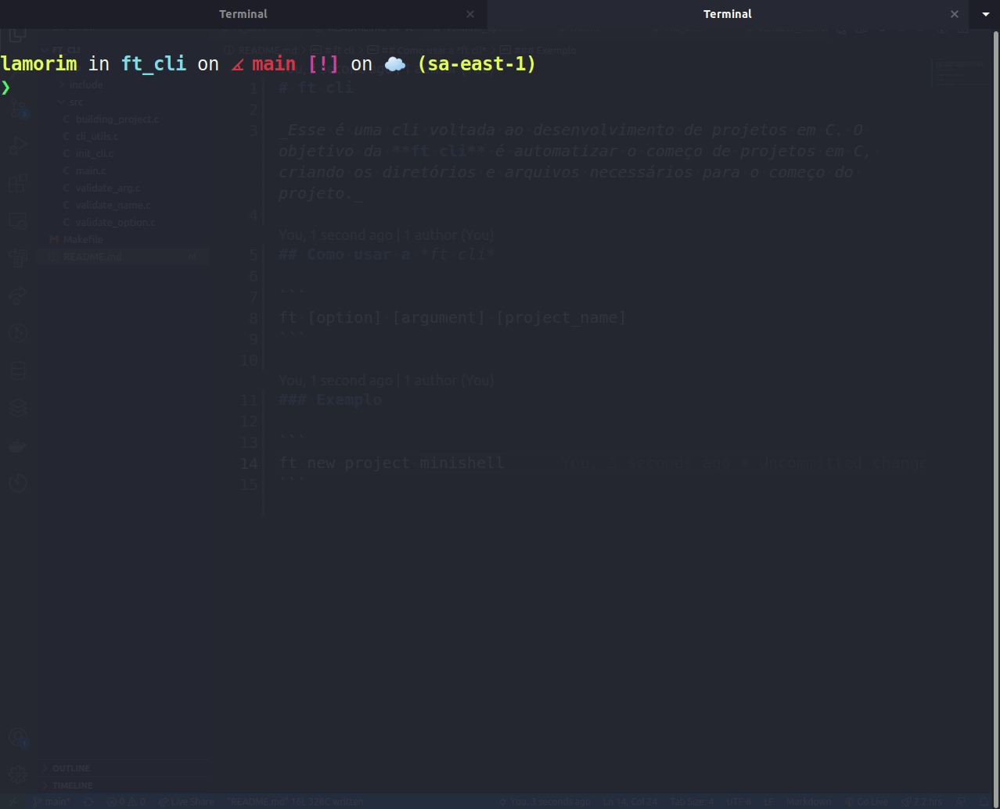

# ft *CLI*

_Esse é uma cli voltada ao desenvolvimento de projetos em C. O objetivo da **ft cli** é automatizar o começo de projetos em C, criando os diretórios e arquivos necessários para o começo do projeto._

## Como instalar

O comando a seguir instalará o projeto em sua máquina.

```sh
sudo make install
```

## Como usar a *ft cli*

```
ft [option] [argument] [project_name]
```

### Exemplo

```
ft new project minishell
```



